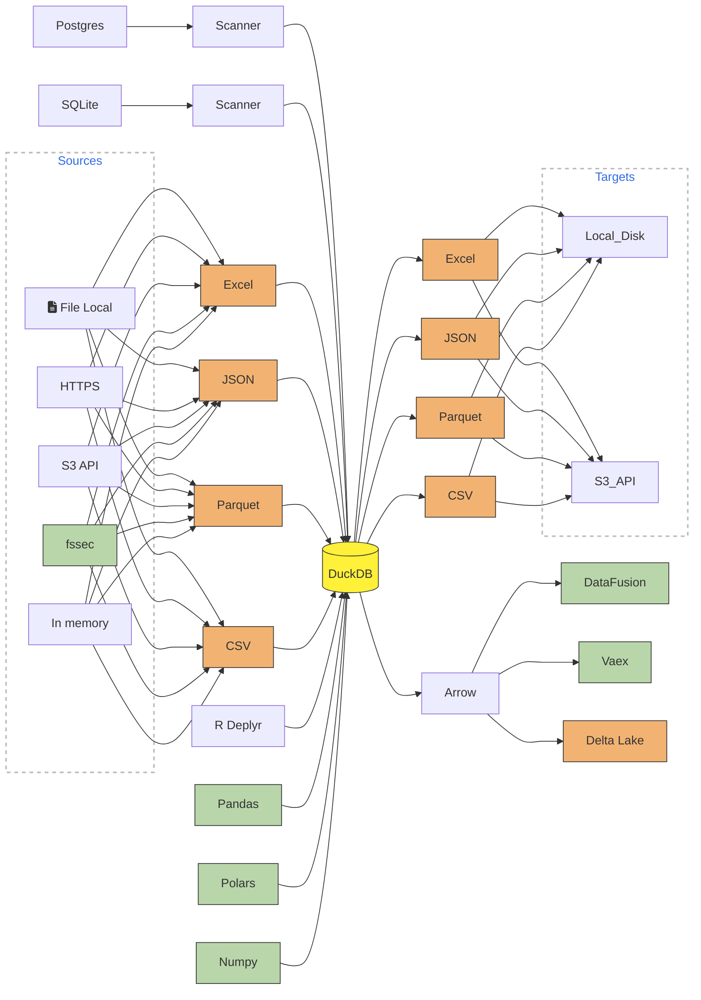

# The Duck Pond
Resources for exploring the [DuckDB](https://duckdb.org) ecosystem.

[Mermaid](https://github.com/mermaid-js/mermaid) based diagramming

## DuckDB Data I/O Pathways

```mermaid

%%{init: {"flowchart": {"curve": "catmullRom"}, "themeVariables": {"edgeLabelBackground": "transparent"}}}%%


flowchart LR

Postgres --> ScannerPG[Scanner] --> DuckDB
SQLite --> ScannerSL[Scanner] --> DuckDB
Local[Local disk] & HTTPS & S3[S3 API] & fssec & InMemory[In memory] --> Excel & JSON & Parquet & CSV
Excel & JSON & Parquet & CSV --> DuckDB
R_deplyr[R Deplyr] & Pandas & Polars & Numpy --> DuckDB
DuckDB --> Excel2[Excel] & JSON2[JSON] & Parquet2[Parquet] & CSV2[CSV]
Excel2 & JSON2 & Parquet2 & CSV2 --> Local_Disk & S3_API
DuckDB --> Arrow
Arrow --> DataFusion & Vaex & Delta_Lake[Delta Lake]


subgraph Sources
Local & HTTPS & S3 & fssec & InMemory
end

subgraph Targets
Local_Disk & S3_API
end

click DuckDB "https://duckdb.org/"
click ScannerPG "https://duckdb.org/docs/extensions/postgres_scanner.html"
click ScannerSL "https://duckdb.org/docs/extensions/sqlite_scanner"

class Sources,Targets cd_dashed;
class DuckDB cd_yellow;
class Excel,JSON,Parquet,CSV,Excel2,JSON2,CSV2,Parquet2,Delta_Lake cd_orange;
class fssec,Pandas,Polars,Numpy,DataFusion,Vaex cd_green;

classDef cd_grey   fill:#ddd,stroke:#fff,stroke-width:4px,color:#000;
classDef cd_yellow fill:#FFF03A,stroke:#333,stroke-width:px
classDef cd_orange fill:#F2B372,stroke:#333,stroke-width:px
classDef cd_green fill:#B9D6AA,stroke:#333,stroke-width:px
classDef cd_dashed fill:#fff,stroke:#bbb,stroke-width:2px,color:#326ce5,stroke-dasharray: 5 5;
classDef cd_box2 fill:#326ce5,stroke:#fff,stroke-width:4px,color:#fff;
classDef cd_box3 fill:#fff,stroke:#bbb,stroke-width:2px,color:#326ce5;
classDef cd_box5 fill:#bbf,stroke:#f66,stroke-width:2px,color:#fff,stroke-dasharray: 5 5


DuckDB[("DuckDB")]
Local[fa:fa-file-alt File Local]


```